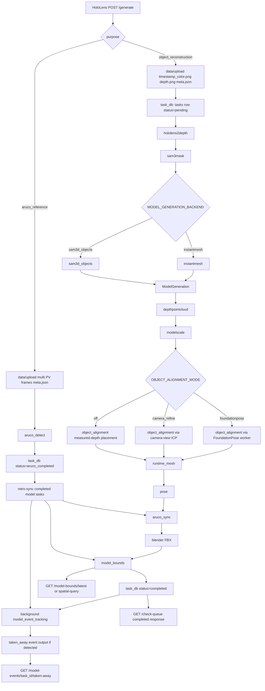

# Server Processing And Output Contract

这份文档描述当前服务器端的完整处理流程、主要 JSON 记录格式、目录/文件布局，以及建议的两种输出模式：最小生成模式和带 debug 附录模式。

本文关注“服务器内部和客户端可消费的输出契约”，不是算法细节文档。坐标轴约定见 `docs/coordinate-systems.md`，拿走事件状态机见 `docs/model-event-tracking-state-machine.md`。

## 总览

服务器围绕一个 task JSON 运行。`/generate` 接收 HoloLens 上传数据后，在 `data/upload/` 写入输入图片和 `<timestamp>_meta.json`。worker 按 stage 顺序执行，每个 stage 读取同一个 JSON、写入自己的输出文件，并把稳定结果字段写回同一个 JSON。

数据库 `data/database/tasks.db` 只负责排队、状态、stage run 记录、ArUco reference 索引和 model bounds 索引。长期结果以 task JSON 和 `data/output/` 文件为准。

## 整体流程图



## Runtime Roots

默认路径来自 `code/config.py`。

```text
/workspace/data/
  upload/                         # 上传的原始输入和主 task JSON
  database/tasks.db               # 任务队列、stage runs、ArUco/model bounds 索引
  output/
    hololens2/                    # HoloLens depth/RGB 配准输出
    sam3/                         # SAM3 box mask 输出
    instantmesh-input/            # InstantMesh 输入准备目录
    instant-mesh-large/
      meshes/                     # InstantMesh OBJ/MTL
      images/                     # InstantMesh texture PNG
      videos/                     # InstantMesh preview MP4
    sam3d-objects/
      meshes/                     # SAM 3D Objects raw/processed mesh assets
    object_alignment/             # 对齐预览、点云等可选诊断输出
    runtime_mesh/                 # Unity runtime OBJ/MTL/texture
    blender/fbx/                  # 最终 FBX
    model_events/                 # 拿走事件输出
  shigure_event_cache/
    frames/<sec_nsec>/messages/   # Shigurei RGB-D/people history snapshots
    camera_info/<sha256>.json     # 去重保存的 camera info
  worker_sockets/                 # 常驻模型服务 socket
```

HTTP 文件下载只暴露 `FOLDER_MAP` 中登记的目录：

```text
/files/meshes/<filename>              -> data/output/instant-mesh-large/meshes
/files/images/<filename>              -> data/output/instant-mesh-large/images
/files/videos/<filename>              -> data/output/instant-mesh-large/videos
/files/sam3d_object_meshes/<filename> -> data/output/sam3d-objects/meshes
/files/runtime_meshes/<filename>      -> data/output/runtime_mesh
/files/fbx/<filename>                 -> data/output/blender/fbx
```

拿走事件文件使用独立接口：

```text
/model-events/<task_id>/taken-away
/model-events/<task_id>/taken-away/files/<filename>
```

## Database Records

### `tasks`

主任务表。

```json
{
  "task_id": "uuid",
  "status": "pending | stage_name | completed | aruco_completed | failed",
  "json_path": "data/upload/<timestamp>_meta.json",
  "startup_session_id": "HoloLens 启动会话，可为空",
  "aruco_coordinate_synced": 0,
  "created_at": "UTC text",
  "started_at": "UTC text or null",
  "completed_at": "UTC text or null",
  "updated_at": "UTC text",
  "error_message": "stage failure text or null"
}
```

允许的 stage/status：

```text
pending
hololens2depth
aruco_detect
sam3mask
instantmesh
depthpointcloud
modelscale
object_alignment
pose
aruco_sync
runtime_mesh
blender
model_bounds
completed
aruco_completed
failed
```

`model_event_tracking` 是后台 stage run，会写入 `task_stage_runs`，但不作为主 `tasks.status` 阻塞模型生成完成。

### `task_stage_runs`

每个 stage 的运行记录，适合放在 debug 附录或管理端显示。

```json
{
  "task_id": "uuid",
  "stage_name": "sam3mask",
  "status": "running | completed | failed",
  "started_at": "UTC text",
  "completed_at": "UTC text or null",
  "duration_ms": 12345,
  "error_message": null
}
```

### `aruco_references`

ArUco reference task 成功后写入。

```json
{
  "startup_session_id": "session id",
  "task_id": "reference task uuid",
  "created_at": "UTC text",
  "marker_pose_json": {
    "position": [0.0, 0.0, 0.0],
    "rotation_quaternion_xyzw": [0.0, 0.0, 0.0, 1.0]
  },
  "raw_record_path": "data/aruco/runtime/<task>/...json",
  "config_snapshot_json": {
    "template": {},
    "registered_markers": [],
    "anchor_marker_id": 1
  }
}
```

### `model_bounds`

用于空间查询和 Unity 点击/射线选择。

```json
{
  "task_id": "model task uuid",
  "status": "pending | ready | failed | pending_reference",
  "uploaded_at": "UTC text",
  "model_name": "task_name",
  "fbx_name": "final.fbx",
  "coordinate_space": "aruco",
  "aruco_reference_task_id": "reference uuid or null",
  "object_aruco_json": {
    "position": [0.0, 0.0, 0.0],
    "rotation_quaternion_xyzw": [0.0, 0.0, 0.0, 1.0],
    "scale": [1.0, 1.0, 1.0]
  },
  "aabb_min_aruco_json": [0.0, 0.0, 0.0],
  "aabb_max_aruco_json": [0.0, 0.0, 0.0],
  "corners_aruco_json": [[0.0, 0.0, 0.0]],
  "source_model_path": "data/output/runtime_mesh/model.obj",
  "error_message": null
}
```

## Upload And Initial Task JSON

`POST /generate` 接收 multipart form。

### Common Form Fields

```text
purpose: object_reconstruction | aruco_reference
deviceJ: JSON object
PVCameraJ: JSON object, object_reconstruction 使用
PVCameraFramesJ: JSON array, aruco_reference 可使用多帧
pv_image or pv_image_<index>: PNG bytes
```

### Object Reconstruction Extra Fields

```text
DepthCameraJ: JSON object
depth_image: uint16 PNG bytes
SelectionBoxJ: JSON object {top_left:[x,y], bottom_right:[x,y]}
```

创建的文件：

```text
data/upload/<timestamp>_color.png
data/upload/<timestamp>_depth.png
data/upload/<timestamp>_meta.json
```

初始 object task JSON：

```json
{
  "server_received_utc": "2026-06-05T09:26:54.894340Z",
  "task_name": "20260605_092654_894340Z",
  "purpose": "object_reconstruction",
  "device": {
    "type": "",
    "ip": "",
    "time": "client time",
    "pose": "raw device pose matrix or object",
    "startup_session_id": "session id"
  },
  "PVCamera": {
    "name": "<timestamp>_color.png",
    "width": 1280,
    "height": 720,
    "k": [0.0],
    "pose": "raw PV pose",
    "position": [0.0, 0.0, 0.0],
    "rotation_quaternion_xyzw": [0.0, 0.0, 0.0, 1.0]
  },
  "PVCameraFrames": [
    {
      "frame_index": 0,
      "width": 1280,
      "height": 720,
      "k": [0.0],
      "pose": "raw PV pose",
      "position": [0.0, 0.0, 0.0],
      "rotation_quaternion_xyzw": [0.0, 0.0, 0.0, 1.0],
      "time": "client time",
      "device_pose": null,
      "device_rotation": null,
      "name": "<timestamp>_color.png",
      "upload_field": "pv_image",
      "png_bytes": 123456
    }
  ],
  "DepthCamera": {
    "name": "<timestamp>_depth.png",
    "pose": "raw depth pose",
    "sensor": "AHAT | LONGTHROW",
    "stats": {
      "sensor": "AHAT",
      "width": 512,
      "height": 512,
      "raw_nonzero_pixels": 0,
      "valid_depth_pixels": 0,
      "clipped_depth_pixels": 0,
      "min_depth_mm": 200,
      "max_reliable_depth_mm": 1000,
      "input_png_bytes": 0,
      "sanitized_png_bytes": 0
    }
  },
  "SelectionBox": {
    "top_left": [0, 0],
    "bottom_right": [100, 100]
  },
  "task_id": "uuid"
}
```

ArUco reference task 不要求 depth 和 selection box。它通常写入多张：

```text
data/upload/<timestamp>_color_000.png
data/upload/<timestamp>_color_001.png
...
data/upload/<timestamp>_meta.json
```

## Object Reconstruction Stage Outputs

### 1. `hololens2depth`

输入：上传的 PV/depth 图和相机参数。

写回 `DepthCamera` 的附加字段：

```json
{
  "DepthCamera": {
    "align_depth_name": "<timestamp>_aligned_depth.png",
    "align_depth_turbo_name": "<timestamp>_aligned_depth_turbo.png",
    "align_depth_stats": {
      "width": 1280,
      "height": 720,
      "valid_depth_pixels": 0,
      "min_depth_mm": 0,
      "max_depth_mm": 0
    }
  }
}
```

主要目录：

```text
data/output/hololens2/
```

### 2. `sam3mask`

输入：PV RGB、配准 depth、用户选择框。

输出目录：

```text
data/output/sam3/
  <task>_sam3_mask.png
  <task>_sam3_color.png
  <task>_sam3_depth.png
  <task>_sam3_overlay.png
```

写回：

```json
{
  "sam3Name": {
    "mask": "<task>_sam3_mask.png",
    "color": "<task>_sam3_color.png",
    "depth": "<task>_sam3_depth.png",
    "overlay": "<task>_sam3_overlay.png"
  }
}
```

### 3. `instantmesh` 或 `sam3d_objects`

这两个后端占用同一个主 stage slot，数据库状态仍叫 `instantmesh`。实际后端由 `MODEL_GENERATION_BACKEND` 决定。

#### InstantMesh

输出目录：

```text
data/output/instantmesh-input/
data/output/instant-mesh-large/meshes/
data/output/instant-mesh-large/images/
data/output/instant-mesh-large/videos/
```

写回：

```json
{
  "InstantMesh": {
    "mesh": "model_clean.obj",
    "mtl": "model.mtl",
    "image": "texture.png",
    "video": "preview.mp4",
    "video_render_enabled": true,
    "raw_mesh": "model.obj",
    "cleanup": {
      "removed_faces": 0,
      "kept_faces": 0,
      "component_count": 0
    }
  },
  "ModelGeneration": {
    "backend": "instantmesh",
    "source_stage": "InstantMesh",
    "mesh_folder": "meshes",
    "mesh": "model_clean.obj",
    "mtl": "model.mtl",
    "image": "texture.png",
    "video": "preview.mp4",
    "video_folder": "videos",
    "runtime_ready": false,
    "video_render_enabled": true,
    "raw_mesh": "model.obj",
    "cleanup": {}
  }
}
```

#### SAM 3D Objects

输出目录：

```text
data/output/sam3d-objects/meshes/
  <task>_raw.glb
  <task>.obj
  <task>.mtl
  <task>.png
  <task>_stats.json
```

写回：

```json
{
  "SAM3DObjects": {
    "backend": "sam3d_objects",
    "source_stage": "SAM3DObjects",
    "mesh_folder": "sam3d_object_meshes",
    "mesh": "model.obj",
    "mtl": "model.mtl",
    "image": "texture.png",
    "runtime_ready": false,
    "raw_glb": "model_raw.glb",
    "source_color": "<task>_sam3_color.png",
    "source_mask": "<task>_sam3_mask.png",
    "config": ".../pipeline.yaml",
    "seed": 42,
    "attn_backend": "sdpa",
    "postprocess": {}
  }
}
```

`ModelGeneration` 会写入同一份 payload 的拷贝，用于后续 stage 统一解析不同模型生成后端。

### 4. `depthpointcloud`

输入：SAM3 mask/depth、PV intrinsics。

输出：主要写 JSON，点云/抽样文件按 debug 配置写入 `data/output/object_alignment/`。

写回：

```json
{
  "depthpointcloud": {
    "depth_sensor": "AHAT",
    "min_depth_mm": 200,
    "max_reliable_depth_mm": 1000,
    "width_pointcloud_units": 0.1,
    "height_pointcloud_units": 0.1,
    "depth_pointcloud_units": 0.1,
    "real_width_measured": 0.1,
    "real_height_measured": 0.1,
    "mean_depth_measured": 0.5,
    "raw_point_count": 10000,
    "point_count": 6000,
    "valid_depth_ratio": 0.8,
    "mask_bbox_xyxy": [0, 0, 100, 100],
    "mask_pixels": 10000,
    "valid_depth_pixels": 8000,
    "depth_border_crop_ratio": 0.03,
    "usable_mask_pixels": 7000,
    "cropped_mask_pixels": 300,
    "discarded_count": 1000,
    "used_count": 3600,
    "icp_target_front_max_points": 3600
  }
}
```

### 5. `modelscale`

输入：生成 mesh 尺寸和 `depthpointcloud` 实测尺寸。

写回：

```json
{
  "model": {
    "width_model_units": 1.0,
    "height_model_units": 1.0,
    "depth_model_units": 1.0,
    "width_measured": 1.0,
    "height_measured": 1.0,
    "width_scale": 0.1,
    "height_scale": 0.1,
    "overall_scale": 0.1
  }
}
```

### 6. `object_alignment`

输入：模型、点云、mask、PV camera、对齐配置。

模式：

```text
OBJECT_ALIGNMENT_MODE=foundationpose  # 当前默认，使用 FoundationPose 常驻服务
OBJECT_ALIGNMENT_MODE=camera_refine   # camera-view ICP refinement
OBJECT_ALIGNMENT_MODE=off             # 不做 ICP，用测距/box 放置
```

输出目录：

```text
data/output/object_alignment/
  <task>_*.ply                        # 可选点云/使用点/丢弃点
  <task>_*preview*.png                # ENABLE_ALIGNMENT_RENDER_OUTPUTS=true 时
```

写回最小字段：

```json
{
  "object_alignment": {
    "camera_local_position": [0.0, 0.0, -0.5],
    "camera_local_rotation_quaternion_xyzw": [0.0, 0.0, 0.0, 1.0],
    "model_real_scale": 0.1,
    "alignment_mode": "foundationpose",
    "alignment_solver": "foundationpose",
    "alignment_backend": "foundationpose",
    "alignment_device": "cuda:0",
    "alignment_device_name": "GPU name",
    "geometry_backend": "numpy | cupy | torch",
    "icp_mode": "foundationpose",
    "icp_enabled": false,
    "preview_image_name": null,
    "preview_image_unaligned_name": null,
    "confidence": 0.0,
    "alignment_rmse": 0.0,
    "target_point_count": 6000,
    "target_front_point_count": 3600,
    "discarded_point_count": 0
  }
}
```

Debug 附录写在：

```json
{
  "debug": {
    "pose_transform_stages": {
      "object_alignment": {
        "final_camera_local_rh": {}
      }
    }
  }
}
```

### 7. `runtime_mesh`

输入：`ModelGeneration` 产物。

输出目录：

```text
data/output/runtime_mesh/
  <source>_runtime_<ratio>_<texture_size>.obj
  <source>_runtime_<ratio>_<texture_size>.mtl
  <source>_runtime_<ratio>_<texture_size>.png
```

写回：

```json
{
  "RuntimeMesh": {
    "mesh": "runtime.obj",
    "mtl": "runtime.mtl",
    "image": "runtime.png",
    "source_stage": "InstantMesh | SAM3DObjects",
    "source_backend": "instantmesh | sam3d_objects",
    "source_mesh_folder": "meshes | sam3d_object_meshes",
    "source_mesh": "source.obj",
    "source_mtl": "source.mtl",
    "source_image": "source.png",
    "decimate_ratio": 0.0625,
    "texture_size": 1024,
    "bake_margin_px": 64,
    "uv_island_margin": 0.03,
    "original_vertices": 0,
    "original_faces": 0,
    "vertices": 0,
    "faces": 0
  }
}
```

### 8. `pose`

输入：`object_alignment` camera-local pose、PV camera world pose、runtime mesh axis contract。

写回：

```json
{
  "object_world": {
    "position": [0.0, 0.0, 0.0],
    "rotation_quaternion_xyzw": [0.0, 0.0, 0.0, 1.0],
    "scale": [0.1, 0.1, 0.1]
  },
  "debug": {
    "pose_transform_stages": {
      "pose_stage": {
        "alignment_camera_local": {},
        "pv_camera_world": {},
        "runtime_asset": {},
        "final_object_world": {}
      }
    }
  }
}
```

### 9. `aruco_sync`

输入：`object_world` 和当前 startup session 的最新 ArUco reference。

写回成功时：

```json
{
  "aruco_reference": {
    "position": [0.0, 0.0, 0.0],
    "rotation_quaternion_xyzw": [0.0, 0.0, 0.0, 1.0]
  },
  "object_aruco": {
    "position": [0.0, 0.0, 0.0],
    "rotation_quaternion_xyzw": [0.0, 0.0, 0.0, 1.0],
    "scale": [0.1, 0.1, 0.1]
  },
  "debug": {
    "pose_transform_stages": {
      "aruco_stage": {
        "reference_task_id": "uuid",
        "reference_created_at": "UTC text",
        "synced_to_reference": true,
        "sync_reason": "reference_applied",
        "object_aruco": {}
      }
    }
  }
}
```

没有 reference 时，`debug.pose_transform_stages.aruco_stage.sync_reason` 为 `reference_not_found`，`model_bounds` 可能进入 `pending_reference`。

### 10. `blender`

输入：优先 runtime mesh 或生成 mesh、`object_world.scale`。

输出目录：

```text
data/output/blender/fbx/
  <model>.fbx
  <model>_baked.png                 # 部分 SAM3D/FBX 后处理会生成
```

写回：

```json
{
  "Blender": {
    "fbx": "model.fbx",
    "source_stage": "RuntimeMesh | SAM3DObjects | InstantMesh",
    "source_mesh": "source.obj",
    "source_mesh_folder": "runtime_meshes",
    "source_backend": "runtime_mesh | sam3d_objects | instantmesh",
    "source_format": "obj | glb",
    "source_texture": "texture.png",
    "postprocess": {
      "decimate": {},
      "cleanup": {},
      "color_texture_bake": {}
    }
  }
}
```

### 11. `model_bounds`

输入：最终 source model、`object_aruco`、`object_world.scale`。

写入数据库 `model_bounds`，并同步写回 task JSON：

```json
{
  "ModelBounds": {
    "status": "ready | pending_reference | failed",
    "coordinate_space": "aruco",
    "source_model_path": "data/output/runtime_mesh/model.obj",
    "aabb_min_aruco": [0.0, 0.0, 0.0],
    "aabb_max_aruco": [0.0, 0.0, 0.0],
    "corners_aruco": [[0.0, 0.0, 0.0]],
    "error_message": null
  }
}
```

`model_bounds` 完成后，主任务状态变为 `completed`，模型可以先下发给 HoloLens。后台拿走追踪随后开始，不阻塞模型生成结果。

## ArUco Reference Flow

ArUco reference task 使用 `purpose=aruco_reference`，stage 顺序只有：

```text
aruco_detect -> aruco_completed
```

输出目录：

```text
data/aruco/runtime/<task_name>/
  aruco_record.json                 # 实际文件名由 aruco_common 生成
```

写回 task JSON：

```json
{
  "aruco_reference": {
    "position": [0.0, 0.0, 0.0],
    "rotation_quaternion_xyzw": [0.0, 0.0, 0.0, 1.0]
  },
  "debug": {
    "pose_transform_stages": {
      "aruco_stage": {
        "detected": true,
        "matched_marker_id": 1,
        "short_circuit": true,
        "marker_pose_world": {},
        "anchor_pose_candidates": [],
        "relation_updates": [],
        "retro_synced_completed_task_count": 0
      }
    }
  }
}
```

同时写入 `aruco_references` 表。完成后 worker 会尝试 retro-sync 同一 startup session 的已完成模型任务：重新执行 `aruco_sync`、`model_bounds`，并排队后台 `model_event_tracking`。

## Model Event Tracking Output

后台 stage：`model_event_tracking`。

输入：已完成模型的 `Blender.fbx`、`ModelBounds.corners_aruco`、Shigurei RGB-D 缓存、marker pose、camera info。

主 task JSON 写回 `ModelEventTracking`：

```json
{
  "ModelEventTracking": {
    "status": "running | skipped | taken_away | timeout | no_event | occluded_unresolved | failed",
    "updated_at": "UTC iso",
    "detector": "fbx_depth_template",
    "cache_root": "data/shigure_event_cache",
    "cached_frame_count": 0,
    "valid_frame_count": 0,
    "frame_count": 0,
    "initial_frame_count": 0,
    "checked_frame_count": 0,
    "tracking_window": {},
    "marker_pose_path": ".../marker_6d_pose.json",
    "marker_pose_source": "cached_frame | historical_marker_pose | env:MODEL_EVENT_MARKER_POSE_JSON",
    "camera_info_path": "...cameraInfo.json",
    "projected_box": {},
    "debug_projection_path": "data/output/model_events/<task>/debug/depth_tracking/projection_and_model_mask.jpg",
    "depth_template_dir": "data/output/model_events/<task>/debug/depth_tracking/template",
    "depth_diagnostics_path": "data/output/model_events/<task>/debug/depth_tracking/diagnostics.json",
    "depth_bias_m": 0.0,
    "timeout_seconds": 600.0,
    "timed_out": false,
    "active_full_occlusion_start": null,
    "full_occlusion_segments": [],
    "final_support_pixels": 0,
    "final_unoccluded_pixels": 0,
    "current_support_mask_path": ".../current_support_mask.png",
    "current_unoccluded_mask_path": ".../current_unoccluded_mask.png",
    "event_record": {}
  }
}
```

事件输出目录：

```text
data/output/model_events/<task_name>/
  .tracking.lock
  taken_away/
    event.json
    rgb.png
    skeletons.json
    skeleton_overlay.png
    body_mesh.json                  # 可选，SAM3D Body 生成成功时
    debug/
      depth.png
      camera_info.json
      marker_pose.json
      people_detection.json
      moved_mask.png
      decision_overlay.png
      projected_box.json
      body_mesh_error.json          # 可选，SAM3D Body 失败时
  debug/depth_tracking/
    projection_and_model_mask.jpg
    reference_observed_mask.png
    current_support_mask.png
    current_unoccluded_mask.png
    diagnostics.json
    template/
      front_depth_m.npy
      back_depth_m.npy
      hit_count.npy
      model_mask.png
      template.json
      render_config.json
      blender_debug.json
      render_depth_layers.py
    frames/                         # MODEL_EVENT_DEBUG_EVERY_FRAME=true 时
```

`taken_away/event.json`：

```json
{
  "task_id": "uuid",
  "event_type": "taken_away",
  "event_timestamp": {"sec": 1780651939, "nanosec": 615522870},
  "trigger_timestamp": null,
  "decision": {
    "status": "taken_away",
    "moved": true,
    "occluded": false,
    "stable_in_place": false,
    "should_stop_tracking": true,
    "reason": "human readable summary",
    "timestamp": {"sec": 0, "nanosec": 0},
    "trigger_contact": null,
    "center_delta_m": null,
    "depth_delta_m": 0.0,
    "overlap_pixels": 0,
    "visible_area_ratio": 0.0,
    "area_ratio": 0.0,
    "mask_iou": 0.0,
    "movement_candidate_frames": 3,
    "depth_decision_timestamp": {"sec": 0, "nanosec": 0},
    "depth_confirm_timestamp": {"sec": 0, "nanosec": 0},
    "full_occlusion_start_timestamp": null,
    "rgb_motion_start_timestamp": {"sec": 0, "nanosec": 0},
    "display_timestamp": {"sec": 0, "nanosec": 0},
    "rgb_motion_score": 0.0,
    "rgb_motion_metadata": {}
  },
  "hand_contact": null,
  "output_dir": "data/output/model_events/<task>/taken_away",
  "files": {
    "rgb": ".../rgb.png",
    "skeletons": ".../skeletons.json",
    "skeleton_overlay": ".../skeleton_overlay.png",
    "body_mesh": ".../body_mesh.json"
  },
  "projected_box": {
    "coordinate_system": "opencv_camera",
    "corners_camera_m": [],
    "pixel_points": [],
    "bbox_xyxy": [0, 0, 0, 0],
    "center_camera_m": [0.0, 0.0, 0.0]
  },
  "evidence_frame": {
    "stamp": {"sec": 0, "nanosec": 0},
    "rgb_path": "...png",
    "depth_path": "...png",
    "camera_info_path": "...json",
    "people_path": "...json",
    "marker_pose_path": "...json",
    "node_paths": {}
  },
  "debug_files": {
    "depth": ".../debug/depth.png",
    "camera_info": ".../debug/camera_info.json",
    "marker_pose": ".../debug/marker_pose.json",
    "moved_mask": ".../debug/moved_mask.png",
    "decision_overlay": ".../debug/decision_overlay.png",
    "projected_box": ".../debug/projected_box.json"
  },
  "body_mesh_metadata": {
    "status": "ok | failed | disabled | missing_runtime",
    "target": ".../body_mesh.json",
    "decimate_ratio": 0.125
  }
}
```

GET `/model-events/<task_id>/taken-away` 会读取 `event.json`，并在响应里动态追加：

```json
{
  "success": true,
  "event": {
    "...event fields...": "...",
    "download_urls": {
      "rgb": "http://host/model-events/<task_id>/taken-away/files/rgb.png",
      "skeletons": "http://host/model-events/<task_id>/taken-away/files/skeletons.json",
      "skeleton_overlay": "http://host/model-events/<task_id>/taken-away/files/skeleton_overlay.png",
      "body_mesh": "http://host/model-events/<task_id>/taken-away/files/body_mesh.json"
    }
  }
}
```

## Shigurei History Cache

服务启动后，如果 `SHIGURE_EVENT_RECORDING_ENABLE=1`，recorder 会自动维护本地环形缓存。

```text
data/shigure_event_cache/
  recorder_status.json
  camera_info/<sha256>.json
  frames/<sec_nsec>/
    manifest.json
    messages/
      rs_color_compressed.png
      rs_aligned_depth_to_color_compressedDepth.png
      rs_aligned_depth_to_color_cameraInfo.json
      shigure_people_detection.json
      marker_6d_pose.json           # 有则保存；没有可用历史 marker fallback
```

缓存设计原则：只保留拿走事件需要的 RGB、aligned depth、camera info、people detection、marker pose 引用。默认总量按 `SHIGURE_HISTORY_SECONDS * SHIGURE_HISTORY_HZ` 限制，不是单次启动限制。

## API Response Contracts

### `POST /generate`

成功：

```json
{"task_id": "uuid"}
```

失败：

```json
{"error": "message"}
```

### `POST /check-queue`

请求：

```json
{"task_ids": ["uuid"]}
```

未完成：

```json
{
  "ready": false,
  "pending": [
    {"task_id": "uuid", "status": "sam3mask", "purpose": "object_reconstruction"}
  ]
}
```

模型完成：

```json
{
  "ready": true,
  "task_id": "uuid",
  "status": "completed",
  "purpose": "object_reconstruction",
  "terminal": true,
  "task": {
    "status": "completed",
    "task_id": "uuid",
    "purpose": "object_reconstruction",
    "terminal": true,
    "stage_runs": [],
    "aruco_coordinate_synced": true,
    "placement_status": "aruco_synced | world_temporary | missing_pose",
    "model_bounds": {},
    "model_generation": {},
    "mesh_url": "http://host/files/meshes/model.obj",
    "mtl_url": "http://host/files/meshes/model.mtl",
    "image_url": "http://host/files/images/texture.png",
    "video_url": "http://host/files/videos/preview.mp4",
    "runtime_mesh_url": "http://host/files/runtime_meshes/runtime.obj",
    "runtime_mtl_url": "http://host/files/runtime_meshes/runtime.mtl",
    "runtime_image_url": "http://host/files/runtime_meshes/runtime.png",
    "runtime_mesh": {},
    "fbx_url": "http://host/files/fbx/model.fbx",
    "model_instance": {
      "model_key": "uuid",
      "task_id": "uuid",
      "fbx_url": "http://host/files/fbx/model.fbx",
      "object_world": {},
      "object_aruco": {},
      "aruco_reference": {}
    },
    "object_world": {},
    "object_aruco": {},
    "aruco_reference": {},
    "debug": {}
  }
}
```

ArUco reference 完成：

```json
{
  "ready": true,
  "task_id": "uuid",
  "status": "aruco_completed",
  "purpose": "aruco_reference",
  "terminal": true,
  "task": {
    "status": "aruco_completed",
    "task_id": "uuid",
    "purpose": "aruco_reference",
    "terminal": true,
    "stage_runs": [],
    "aruco_reference": {},
    "aruco_detected": true,
    "retro_synced_completed_task_count": 0,
    "latest_completed_model_available": true,
    "latest_completed_model_task_id": "uuid"
  }
}
```

失败：

```json
{
  "ready": true,
  "task_id": "uuid",
  "status": "failed",
  "terminal": true,
  "task": {
    "status": "failed",
    "task_id": "uuid",
    "error": "message",
    "stage_runs": []
  }
}
```

## Minimal Output vs Debug Appendix

当前实现已经混合了两类信息：客户端生成模型所需的最小字段，以及排查问题用的 debug/diagnostics 字段。建议以后在同一个 JSON 里用明确分区区分，而不是改变主流程文件名。

推荐模式：

```json
{
  "output_mode": "minimal | with_debug",
  "schema_version": 1,
  "task_id": "uuid",
  "task_name": "timestamp",
  "purpose": "object_reconstruction",
  "minimal": {
    "inputs": {},
    "assets": {},
    "poses": {},
    "bounds": {},
    "event": {}
  },
  "debug_appendix": {
    "enabled": true,
    "stage_runs": [],
    "stage_payloads": {},
    "diagnostics": {},
    "debug_files": {},
    "config_snapshot": {}
  }
}
```

为了兼容现有代码，不建议立刻把正式 task JSON 改成上面的大重构结构。更稳妥的演进方式是：

1. 保持现有 task JSON 顶层字段不变。
2. 增加一个可选顶层字段 `OutputProfile`，声明当前输出意图。
3. 最小模式下，stage 仍可内部生成 debug 文件，但不要把重型 debug 文件加入客户端响应，也可以按配置清理。
4. debug 模式下，把所有附加报告路径集中登记到 `debug` 或 `debug_files`，并在 JSON 文件末尾保留附录块。

### 建议的 `OutputProfile`

```json
{
  "OutputProfile": {
    "mode": "minimal | with_debug",
    "schema_version": 1,
    "created_by": "server_api | task_worker",
    "include_stage_runs": false,
    "include_debug_files": false,
    "include_diagnostics": false,
    "keep_intermediate_assets": false
  }
}
```

### Minimal Mode

目标：专注生成和客户端下载，减少存储压力。

保留在 task JSON 的最小字段：

```text
server_received_utc
task_name
purpose
device.startup_session_id
PVCamera.name / width / height / k / pose / position / rotation_quaternion_xyzw
PVCameraFrames minimal metadata
DepthCamera.name / sensor / stats / align_depth_name
SelectionBox
task_id
sam3Name.mask / color / depth                  # 后续 stage 仍需要
ModelGeneration
RuntimeMesh
object_world
aruco_reference
object_aruco
Blender
ModelBounds
ModelEventTracking.status / event_record       # 可选，事件阶段完成后
```

最小模式下客户端主要消费：

```text
mesh_url / mtl_url / image_url
runtime_mesh_url / runtime_mtl_url / runtime_image_url
fbx_url
model_instance
model_bounds
taken_away_event_url
```

建议不保留或不登记：

```text
sam3 overlay
InstantMesh video
alignment preview PNG
per-frame depth tracking debug frames
model_events debug/depth_tracking/frames
large raw intermediate meshes, unless 后续 stage 仍需要
full stdout/stderr logs in event metadata
```

### With-Debug Mode

目标：保留可复现、可解释和可人工核查的附录。

追加到同一个 JSON 末尾的内容建议集中为：

```json
{
  "debug": {
    "pose_transform_stages": {},
    "stage_payloads": {
      "sam3mask": {},
      "model_generation": {},
      "depthpointcloud": {},
      "object_alignment": {},
      "runtime_mesh": {},
      "pose": {},
      "aruco_sync": {},
      "blender": {},
      "model_bounds": {},
      "model_event_tracking": {}
    },
    "files": {
      "sam3_overlay": "data/output/sam3/<task>_sam3_overlay.png",
      "alignment_preview": "data/output/object_alignment/<task>_preview.png",
      "depth_tracking_diagnostics": "data/output/model_events/<task>/debug/depth_tracking/diagnostics.json"
    },
    "stage_runs": [],
    "config_snapshot": {
      "MODEL_GENERATION_BACKEND": "instantmesh",
      "OBJECT_ALIGNMENT_MODE": "foundationpose",
      "MODEL_EVENT_TRACKING_TIMEOUT_SEC": 600
    }
  }
}
```

事件 JSON 也建议同样分层：

```json
{
  "task_id": "uuid",
  "event_type": "taken_away",
  "decision": {},
  "files": {
    "rgb": "rgb.png",
    "body_mesh": "body_mesh.json"
  },
  "debug_appendix": {
    "debug_files": {},
    "depth_tracking_diagnostics": "../debug/depth_tracking/diagnostics.json",
    "body_mesh_metadata": {}
  }
}
```

### Suggested Environment Switches

可以新增这些配置，先文档约定，再逐步实现：

```text
SERVER_OUTPUT_PROFILE=minimal | with_debug
SERVER_KEEP_INTERMEDIATE_ASSETS=0 | 1
SERVER_INCLUDE_STAGE_RUNS_IN_RESPONSE=0 | 1
SERVER_INCLUDE_DEBUG_URLS_IN_RESPONSE=0 | 1
MODEL_EVENT_DEBUG_EVERY_FRAME=0 | 1
ENABLE_ALIGNMENT_RENDER_OUTPUTS=0 | 1
ENABLE_INSTANTMESH_VIDEO_OUTPUT=0 | 1
```

推荐默认：

```text
SERVER_OUTPUT_PROFILE=minimal
SERVER_KEEP_INTERMEDIATE_ASSETS=0
SERVER_INCLUDE_STAGE_RUNS_IN_RESPONSE=0
SERVER_INCLUDE_DEBUG_URLS_IN_RESPONSE=0
MODEL_EVENT_DEBUG_EVERY_FRAME=0
ENABLE_ALIGNMENT_RENDER_OUTPUTS=0
ENABLE_INSTANTMESH_VIDEO_OUTPUT=0 for production, 1 for demo/debug
```

开发/排查时：

```text
SERVER_OUTPUT_PROFILE=with_debug
SERVER_KEEP_INTERMEDIATE_ASSETS=1
SERVER_INCLUDE_STAGE_RUNS_IN_RESPONSE=1
SERVER_INCLUDE_DEBUG_URLS_IN_RESPONSE=1
MODEL_EVENT_DEBUG_EVERY_FRAME=1 only for short replay windows
```

### Practical Rule

判断某个字段是否属于 minimal：

1. Unity/HoloLens 当前点击、显示、下载、空间查询是否直接需要？需要则 minimal。
2. 后续 stage 是否必须读取？必须则 minimal，即使客户端不用。
3. 人工排查、可视化、日志、阈值解释、历史复现实验才需要？放 debug appendix。
4. 文件很大且可重新生成？默认不进 minimal。
5. 会影响事件责任判断的证据帧、RGB、人体 mesh、event decision？属于 minimal event output；其诊断 overlay 和逐帧报告属于 debug appendix。
