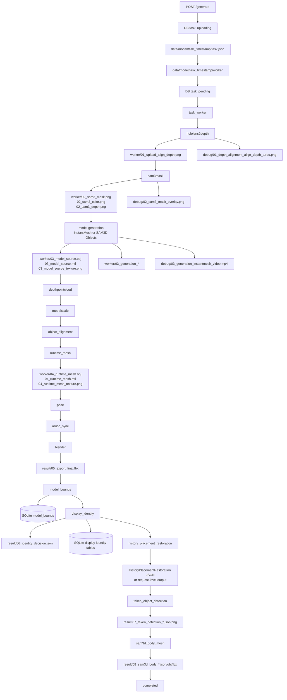

# 任务处理流程与文件组织

日期：2026-06-24  
状态：当前实现说明

## 总览

当前主流程以 `task_timestamp` 推导文件目录，以 SQLite 中的 `task_id` 做任务查询、队列管理和 Unity/服务器通信。`task_id` 不参与文件路径命名。

核心目录由 `code/artifact_layout.py` 定义：

```text
data/
  model/<task_timestamp>/
    task.json
    worker/
    result/
    debug/
    logs/
  aruco_processing/<task_timestamp>/
    task.json
    worker/
    result/
    debug/
  history_placement_requests/<request_timestamp>/
    worker/
    result/
    debug/
  database/tasks.db
  console_logs/
  shigure_history_cache/
  aruco/
  output/                         # 外部工具 scratch / 兼容 HTTP 目录
```

`data/upload/` 不再作为接收缓存。`/generate` 收到请求后先在 DB 中创建 `uploading` task，再把上传文件直接写入对应任务目录；必要文件和 `task.json` 写完后，状态切换为 `pending` 并入队。

## 启动初始化

`server_api.py` import 时执行：

1. `ensure_artifact_roots()`：初始化 `artifact_layout.ARTIFACT_ROOT_DIRS` 中的目录。
2. `initialize_task_table()`：创建或迁移 SQLite schema。
3. `start_worker()`：启动任务 worker 和 Shigurei history recorder sidecar。

`config.py` 只保存运行开关、阈值和 worker 参数。代码路径、脚本路径和 Python/Blender 可执行文件在 `path_config.py`；数据目录和文件命名在 `artifact_layout.py`。

## 主流程图



`history_placement_restoration` 现在主要由独立 API 请求触发，见下方“历史位置再现请求”。模型任务内仍保留 stage 兼容入口，但结果目录以 request 目录为准。

## Model Task 文件

`data/model/<task_timestamp>/task.json` 是该任务的 JSON 交换文件。大文件按用途平铺在 `worker/result/debug/logs` 下。

### `worker/`

```text
01_upload_color.png
01_upload_depth.png
01_upload_meta.json
01_upload_align_depth.png
02_sam3_mask.png
02_sam3_color.png
02_sam3_depth.png
03_model_source.obj
03_model_source.mtl
03_model_source_texture.png
03_generation_instantmesh_input.png
03_generation_instantmesh_raw.obj
03_generation_sam3d_raw.glb
03_generation_sam3d_postprocess.json
04_runtime_mesh.obj
04_runtime_mesh.mtl
04_runtime_mesh_texture.png
```

`03_generation_*` 是生成阶段的中间数据。`03_model_source.*` 是后续阶段使用的规范化模型源文件。

### `result/`

```text
05_export_final.fbx
06_identity_decision.json
07_taken_detection_result.json
07_taken_detection_result_rgb.png
07_taken_detection_result_depth.png
07_taken_detection_camera_info.json
07_taken_detection_active_objects.json
07_taken_detection_marker_6d_pose.json
08_sam3d_body_result.json
08_sam3d_body_people.json
08_sam3d_body_selected_person.obj
08_sam3d_body_selected_person.fbx
```

`result/` 中的文件是最终结果或 Unity/下游稳定读取对象。`05_export_final.fbx` 是 `/generate` 完成后返回下载 URL 的主要模型文件。

### `debug/`

```text
01_depth_alignment_align_depth_turbo.png
02_sam3_mask_overlay.png
03_generation_instantmesh_video.mp4
```

`TASK_DEBUG_OUTPUT_ENABLE=0` 时，debug 文件可以不生成，主流程仍应能运行。InstantMesh video 属于 debug 输出，关闭 debug 时不作为启动参数输出。

## ArUco Processing 文件

ArUco reference 使用独立目录：

```text
data/aruco_processing/<task_timestamp>/
  task.json
  worker/
    <frame_timestamp>_color.png
    <frame_timestamp>_meta.json
  result/
    summary.json
    <frame_timestamp>_marker_detect.json
  debug/
    <frame_timestamp>_aruco_debug_overlay.png
```

当前按单 marker 假设处理。`aruco_debug_overlay.png` 合并搜索范围、检测 ROI、marker 边框/角点/id 和摘要，不再拆成多个可视化图。

## 历史位置再现请求

Unity 点击历史位置再现会创建 request 级目录和 DB 记录：

```text
data/history_placement_requests/<request_timestamp>/
  worker/
    01_request.json
    01_selected_model_tasks.json
    02_result_<index>_working/
    02_result_<index>_working_state.json
  result/
    02_result_<index>_summary.json
    02_response.json
    02_unity_display.json
  debug/
```

`/history-placement-restoration/latest` 读取最新 completed request 的 `result/02_response.json`。Unity 默认使用最新 completed 结果；如果用户中止，服务端应通过 DB 状态区分，而不是靠 task 目录覆盖旧记录。

## Task-local Scratch 目录

全局 `output` 目录已经移除。所有稳定产物写入 task 的 `worker/`、`result/` 或 `debug/`；外部后端必须使用临时目录时，也放在当前 task 的 `worker/<stage>_backend/` 下。

当前示例：

```text
data/model/<task_timestamp>/worker/03_instantmesh_backend/
data/model/<task_timestamp>/worker/04_object_alignment_preview/
```

新代码应通过 `artifact_layout` 的 helper 推导 task 目录，不再新增全局兼容输出根。

## Debug 与耗时记录

调试信息分三类：

- 文件：`model/<task_timestamp>/debug/`、`aruco_processing/<task_timestamp>/debug/`、`history_placement_requests/<request_timestamp>/debug/`。
- DB：`task_stage_runs`、`task_timing_events`、`ai_model_timings`、identity 相关表。
- 日志：`data/console_logs/*.txt`，由 `CONSOLE_OUTPUT_LOG_ENABLE` 控制。

AI 模型耗时分开记录：

- `ai_model_timings.timing_kind = initialization`：模型或长驻服务初始化耗时。
- `ai_model_timings.timing_kind = task`：单次任务实际推理/处理耗时。

## 数据库要点

主表 `tasks` 仍保存 `json_path`，但正常情况下该路径可由 `task_timestamp` 推导：

```text
data/model/<task_timestamp>/task.json
```

`task_id` 用于 API 查询、队列和 Unity 通信；`task_timestamp` 用于文件目录。`artifact_schema_version`、`debug_enabled`、`logs_enabled` 用于标记产物结构和开关状态。

主要状态包括：`uploading`、`upload_failed`、`pending`、各 stage 名、`completed`、`failed`。

## 清理规则

可以清理的运行期目录应按任务维度处理：

- 删除单个模型任务：`data/model/<task_timestamp>/`，同时保留或清理 DB 记录按维护策略决定。
- 删除单次 ArUco 处理：`data/aruco_processing/<task_timestamp>/`。
- 删除单次历史位置再现请求：`data/history_placement_requests/<request_timestamp>/`。
