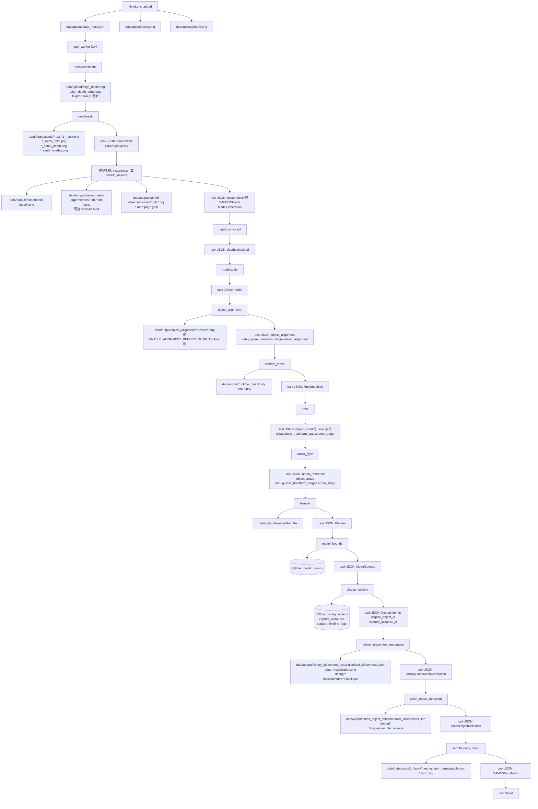
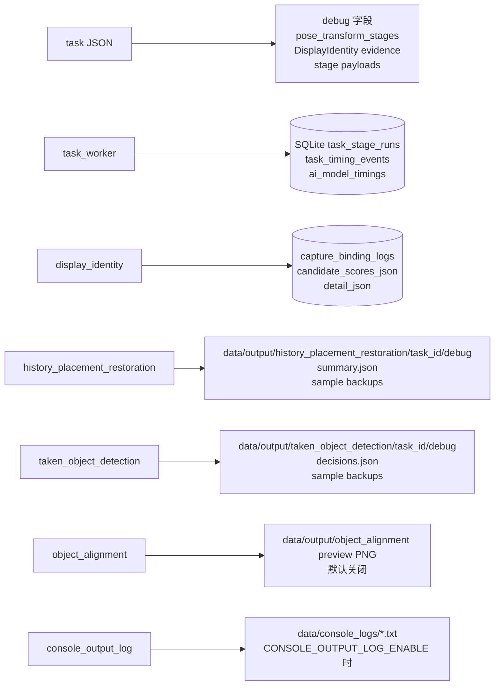
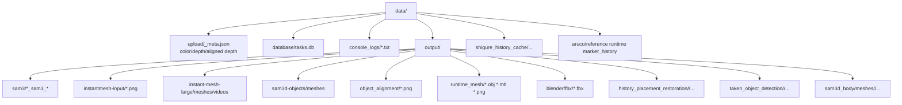

# 任务处理流程与文件组织

日期：2026-06-24
状态：当前实现说明 + 文件组织建议

## 总览

当前主流程以一份 task JSON 为中心推进。task JSON 位于 `data/upload/`，每个 stage 读取它、补写自己的结果字段，然后把大型文件写到 `data/output/<产物类型>/` 或相关缓存目录。数据库保存任务状态、stage 耗时、模型 bounds、AI 模型耗时和显示去重绑定记录。

当前文件组织的特点是：

- 元数据和原始 HoloLens 输入集中在 `data/upload/`。
- 大型产物按类型分散在 `data/output/sam3`、`data/output/instant-mesh-large`、`data/output/object_alignment`、`data/output/runtime_mesh`、`data/output/blender` 等目录。
- 历史位置再现、拿取检测、SAM3D body 已经比较接近按 task 建目录。
- debug 信息一部分在 task JSON 的 `debug` 字段，一部分在 stage 输出目录，一部分在 SQLite timing/log 表。

## 主流程图



## 当前输入与输出清单

| 阶段 | 主要输入 | 主要输出文件 | task JSON/DB 更新 | debug 位置 |
|---|---|---|---|---|
| upload | HoloLens color/depth/meta | `data/upload/<task>_meta.json`, color/depth png | `tasks.json_path`, task row | 原始 meta 本身 |
| `hololens2depth` | raw depth、PV color、相机参数 | `data/upload/*_align_depth.png`, `*_align_depth_turbo.png` | `DepthCamera.align_depth_name`, stats | meta 中的 depth stats |
| `sam3mask` | `SelectionBox`, color, aligned depth | `data/output/sam3/*_sam3_mask.png`, `*_sam3_color.png`, `*_sam3_depth.png`, `*_sam3_overlay.png` | `sam3Name`, `Sam3SpatialBox` | overlay 图，SAM3 timing 输出 |
| `instantmesh` | SAM3 masked color | `data/output/instantmesh-input/*.png`, `data/output/instant-mesh-large/meshes/*.obj/*.mtl/*.png`, 可选 mp4 | `InstantMesh`, `ModelGeneration` | worker stdout，AI timing DB |
| `sam3d_objects` | SAM3 masked color/mask | `data/output/sam3d-objects/meshes/*_raw.glb`, `*_processed.obj/mtl/png/json` | `SAM3DObjects`, `ModelGeneration` | postprocess JSON，AI timing DB |
| `depthpointcloud` | SAM3 mask/depth、PV `k` | 当前不落 PLY 文件，只写统计 | `depthpointcloud` | task JSON 统计字段 |
| `modelscale` | model obj、depthpointcloud | 当前不落独立文件 | `model` | task JSON 统计字段 |
| `object_alignment` | model obj、SAM3 mask/depth、PV `k` | `data/output/object_alignment/*preview*.png`，默认关闭 | `object_alignment`, `debug.pose_transform_stages.object_alignment` | preview 图、task JSON debug |
| `runtime_mesh` | ModelGeneration、object_alignment | `data/output/runtime_mesh/*.obj/*.mtl/*.png` | `RuntimeMesh` | Blender stdout |
| `pose` | object_alignment、device/PV pose | 当前不落独立文件 | `object_world` 等 pose 字段，`debug.pose_transform_stages.pose_stage` | task JSON debug |
| `aruco_sync` | ArUco reference、object_world | 当前不落独立文件 | `aruco_reference`, `object_aruco`, debug | task JSON debug |
| `blender` | runtime mesh/model pose | `data/output/blender/fbx/*.fbx` | `Blender` | Blender stdout |
| `model_bounds` | final source model、`object_aruco` | 当前不落独立文件 | `ModelBounds`, SQLite `model_bounds` | DB error/status |
| `display_identity` | SAM3 mask/color/depth、PV `k`、历史 capture features | 当前不落独立文件 | `DisplayIdentity`, `display_object_id`, `capture_instance_id`, SQLite identity tables | `capture_binding_logs`, evidence paths |
| `history_placement_restoration` | task JSON、Shigurei RGB-D cache、YOLO history、marker history | `data/output/history_placement_restoration/<task_id>/summary.json`, `state_visualization.png`, backups, `debug/baseline_mask.png`, `baseline_reference_depth_m.npy` | `HistoryPlacementRestoration` | output dir/debug、summary timings |
| `taken_object_detection` | task JSON、Shigurei RGB-D cache、YOLO history | `data/output/taken_object_detection/<task_id>/decisions.json`, backups, `debug/projected_mask.png`, `trusted_mask.png`, `reference_depth_m.npy` | `TakenObjectDetection` | output dir/debug |
| `sam3d_body_mesh` | TakenObjectDetection backup frame | `data/output/sam3d_body/meshes/<task_name>/people.json`, `*.npz`, selected `*.obj` | `SAM3DBodyMesh` | people.json、status payload |

## Debug 数据流



debug 当前不是单一目录。排查一个 task 时，通常需要同时看：

- `data/upload/<task>_meta.json`
- `data/output/sam3/*`
- 模型输出目录
- `data/output/history_placement_restoration/<task_id>/` 或 `data/output/taken_object_detection/<task_id>/`
- SQLite 的 stage/timing/identity 表
- 可选 `data/console_logs/*.txt`

## 当前文件布局



这个布局有一个明显问题：同一个 task 的文件散在多个目录里，靠文件名前缀和 task JSON 串起来。对程序来说可用，但对人工排查、清理、打包、复现不够友好。

## 是否要按任务整理

意义比较大，尤其是现在流程已经包含显示身份、历史位置再现、拿取检测、SAM3D body 这些跨阶段逻辑。按任务整理的收益主要有四个：

- 调试更快：一个 task 的输入、产物、debug、summary 都在一个目录，少来回跳目录。
- 清理更安全：可以删除或归档单个 task，不容易误删其它任务共享产物。
- 复现更容易：把 `data/tasks/<task_id>/` 打包即可复跑或发给别人看。
- API 更清楚：服务端可以返回 `artifact_manifest`，Unity 或 debug UI 不需要理解每个 stage 的目录规则。

但不建议立刻硬迁移所有旧目录。原因是当前很多 API、`FOLDER_MAP`、task JSON 字段和历史数据都假设了现有目录。直接改会影响已有模型下载、历史记录和离线脚本。

更稳的方案是增加一个按 task 聚合层，同时保留现有按类型目录作为兼容路径。

## 推荐的新目录结构

推荐目标结构：

```text
data/tasks/<task_id>/
  task_meta.json                 # 当前 task JSON 的权威副本或镜像
  manifest.json                  # 本任务所有 artifact 的索引
  input/
    color.png
    depth.png
    align_depth.png
    align_depth_turbo.png
  sam3/
    mask.png
    color.png
    depth.png
    overlay.png
  model/
    source.obj
    source.mtl
    source_texture.png
    runtime.obj
    runtime.mtl
    runtime_texture.png
    final.fbx
  alignment/
    preview_pointcloud_model.png
    preview_model_compare.png
  identity/
    feature.json
    candidates.json
    decision.json
  history_placement_restoration/
    summary.json
    state_visualization.png
    debug/
    baseline_*/
    current_*/
  taken_object_detection/
    decisions.json
    debug/
    backups/
  sam3d_body/
    people.json
    *.npz
    *.obj
  logs/
    stage_runs.json
    console_tail.txt
```

配套增加 `manifest.json`：

```json
{
  "task_id": "...",
  "task_name": "...",
  "json_path": "data/upload/..._meta.json",
  "artifacts": {
    "input.color": "data/tasks/<task_id>/input/color.png",
    "sam3.mask": "data/tasks/<task_id>/sam3/mask.png",
    "model.final_fbx": "data/tasks/<task_id>/model/final.fbx",
    "identity.decision": "data/tasks/<task_id>/identity/decision.json",
    "history.summary": "data/tasks/<task_id>/history_placement_restoration/summary.json"
  },
  "compat_paths": {
    "sam3.mask": "data/output/sam3/<task>_sam3_mask.png",
    "model.final_fbx": "data/output/blender/fbx/<task>.fbx"
  }
}
```

## 迁移建议

推荐分三步，不一次性打散现有实现：

1. 增加 `task_artifacts`/manifest 工具函数。
   - 输入 `task_id`、`task_name`、artifact kind。
   - 返回 canonical task path 和 legacy compat path。
   - stage 仍可写旧路径，同时把路径登记到 manifest。

2. 新文件优先写 `data/tasks/<task_id>/...`，旧目录保留兼容副本或软链接。
   - 对下载 API 和 Unity 保持原返回不变。
   - task JSON 逐步从只存 filename，过渡到存 manifest key 或 normalized path。

3. 等 API 和历史数据都稳定后，再考虑减少旧目录写入。
   - `FOLDER_MAP` 可以继续服务旧路径。
   - 新 debug UI 优先读 manifest。

## 结论

按任务整理很有意义，但应该作为“artifact manifest + 任务目录聚合”的渐进改造，而不是直接推翻现有 `data/output/<type>` 目录。当前最值得先做的是：为每个 task 生成 `data/tasks/<task_id>/manifest.json`，把现有分散文件索引起来。这样收益最大，风险最小。
